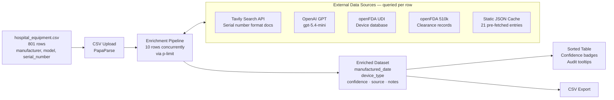
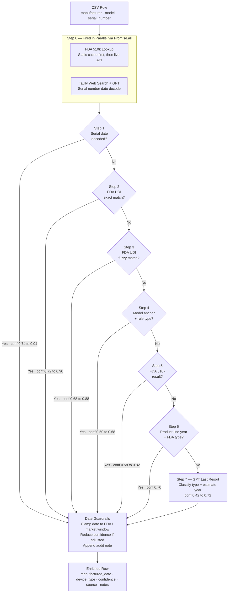
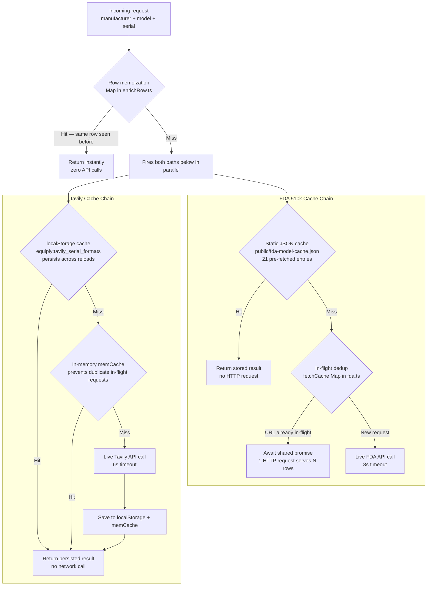

# Equipment Enrichment

**Daivya Shah** | Equiply Hackathon Submission

[View Resume](https://www.daivyashah.com/assets/Daivya_Shah_Resume.pdf) &nbsp;&nbsp; [Download Enriched CSV](https://drive.google.com/file/d/1X3NJWGhNEGVAh2e2eT7NAirZ_aeC7fvD/view?usp=sharing)

> **Note:** I ran the full dataset once using the OpenAI API key provided by Juan — you can verify token usage in the account dashboard.

---

## What I Built

I built a React application that takes a hospital equipment CSV (columns: `manufacturer`, `model`, `serial_number`) and enriches every row with two fields: `manufactured_date` (ISO 8601) and `device_type` (one of 13 standardized categories). The result is a sorted, filterable table with confidence scores, a device type distribution chart, a fleet age chart, and a one-click CSV export.

The input dataset had 801 rows across a wide range of medical device manufacturers. The application processes all of them concurrently, pulling from multiple data sources in a smart, layered way to fill in as many dates and device types as possible.

### System Overview



---

## My Approach: Accuracy First

My focus for this hackathon was enrichment accuracy, meaning getting the manufactured dates and device types as correct and defensible as possible, rather than polishing the UI. (I have a solid foundation in both frontend and backend development — you can find more about my background on [my resume](https://www.daivyashah.com/assets/Daivya_Shah_Resume.pdf).) The reason is simple: if a hospital is using this data for capital replacement planning or compliance audits, a wrong date is worse than no date. So I built the system to be honest about what it knows and what it is guessing. I have a solid foundation in both frontend and backend development — more about my background on [my resume](https://www.daivyashah.com/assets/Daivya_Shah_Resume.pdf).

Every enriched row has:

| Field | Purpose |
|---|---|
| `manufactured_date` | ISO 8601 date. Month/day set to `06-15` when only year precision is known, making estimates visually distinct from exact dates. |
| `device_type` | One of 13 standardized categories, regardless of which source provided the raw label. |
| `confidence` | 0.0 to 1.0. Calculated mechanically from the source, not a subjective score. Reduced automatically if a date was clamped or the encoding method is unverified. |
| `source` | Exactly which data source produced the result: `serial_parse`, `fda_udi_exact`, `fda_udi_fuzzy`, `fda_510k`, `model_reference`, `llm`, or `none`. |
| `notes` | Full audit trail: the decoding method used, FDA K-number citations, and the production window bounds applied. K-numbers link directly to the FDA CDRH database in the UI. |

---

## The Enrichment Pipeline

The core of the application is an 8-step waterfall in `src/lib/enrichRow.ts`. The first step that produces a result wins and the pipeline moves on immediately. The diagram below shows the full decision flow for every row.

### Pipeline Flowchart



### Step-by-Step Breakdown

| Step | Name | Data Source | What It Does | Confidence |
|---|---|---|---|---|
| 0 | Parallel Prefetch | FDA 510k + Tavily + GPT | Fires both the 510k lookup and the Tavily + GPT serial decode simultaneously. Neither waits for the other. Results are held and used by later steps. | N/A |
| 1 | Serial Date Extraction | Tavily + GPT | GPT uses the manufacturer serial format documentation found by Tavily to extract an exact manufacture date from the serial number. Highest-confidence path because it reads the date directly off the device. | 0.74 to 0.94 |
| 2 | FDA UDI Exact Match | openFDA UDI API | Queries the FDA Unique Device Identification database with exact `company_name` and `version_or_model_number` match. Results are scored and ranked before accepting. `publish_date` used as date proxy. | 0.72 to 0.90 |
| 3 | FDA UDI Fuzzy Match | openFDA UDI API | Same database but with prefix wildcards and a `brand_name` fallback. Minimum match score of 5 required to avoid false positives. | 0.68 to 0.88 |
| 4 | Model Anchor + Rule Type | Curated anchor table (37 entries) | For well-known product lines, uses a curated table of floor/ceiling/typical years. The `typicalYear` becomes the manufactured date estimate as `YYYY-06-15`. | 0.50 to 0.68 |
| 5 | FDA 510k as Date Floor | openFDA 510k API | Uses the prefetched 510k clearance date as a regulatory floor for the manufacture date. Device type is re-classified by keyword rules or GPT if it conflicts with known device rules. | 0.58 to 0.82 |
| 6 | Product-Line Year + FDA Type | Anchor table + openFDA UDI | Combines the model anchor typical year with a UDI-sourced device type for rows where no other source worked. | 0.70 |
| 7 | GPT Last Resort | OpenAI GPT | GPT classifies the device type and estimates a manufacture year, constrained to the model anchor window. Only called after all other steps fail. | 0.42 to 0.72 |

### Date Guardrails

Every date produced by any step is passed through `src/lib/dateGuardrails.ts` before the row is finalized. This clamps the date to `[floorYear, ceilingYear]` derived from the model anchor table and the 510k floor. If the date gets adjusted, confidence is reduced and a note is appended explaining the adjustment.

One specific exception: GE serial decodes are ceiling-clamped only, never raised to the FDA floor. This is because GE 510k clearance dates are often from the 1990s for device families that stayed in production for decades, and blindly raising a serial-decoded 2015 date to a 1990s floor would be wrong.

---

## Data Sources and Confidence Ranges

The confidence score for every row is calculated mechanically based on the source, not assigned subjectively. The table below shows the full range.

| Source | Confidence Range | How Trustworthy | Description |
|---|---|---|---|
| Serial decode (Tavily + GPT) | 0.74 to 0.94 | Highest | Date read directly from device serial number |
| FDA UDI exact match | 0.72 to 0.90 | Very high | Exact match in official FDA device registry |
| FDA UDI fuzzy match | 0.68 to 0.88 | High | Fuzzy match in FDA registry, scored for relevance |
| FDA 510k clearance | 0.58 to 0.82 | Medium-high | Regulatory clearance date used as a floor |
| Model reference (anchor) | 0.50 to 0.68 | Medium | Estimate from curated product-line release window |
| GPT classification | 0.42 to 0.72 | Lower | AI estimate when no structured source matched |
| None | 0.0 | No data | No source produced a result |

The UI maps these ranges to badge colors:

| Badge Color | Confidence Threshold | Meaning |
|---|---|---|
| Green | >= 0.80 | High confidence — reliable for decision-making |
| Blue | 0.65 to 0.79 | Medium confidence — reasonable estimate |
| Amber | > 0.0 and < 0.65 | Low confidence — hypothesis only, review recommended |
| None (dash) | 0.0 | Unenriched |

---

## Device Type Taxonomy

All device types are normalized to one of 13 fixed categories regardless of which data source produced them. Raw FDA labels (which can be verbose or inconsistent) are translated by keyword rules in `src/lib/taxonomy.ts`, with GPT as a fallback.

| Category | Example Devices |
|---|---|
| Patient Monitoring | Bedside monitors, telemetry units, pulse oximeters, thermometers, stretchers and beds |
| Defibrillator/Cardiac | AEDs, defibrillators, cardiac monitors |
| Infusion/Pump | IV infusion pumps, syringe pumps |
| Diagnostic/Lab | Thermometers, analyzers, centrifuges, lab instruments |
| Imaging/Radiology | MRI, CT, X-ray systems |
| Ultrasound | Ultrasound units and probes |
| Endoscopy | Endoscopes, endoscopy towers |
| Surgical | Electrosurgical units, surgical tools |
| Ventilator/Respiratory | Ventilators, respiratory support devices |
| Dialysis | Dialysis machines |
| Sterilization | Autoclaves, sterilization systems |
| Other | Compression devices, specialized equipment |
| Unknown | Could not be determined |

---

## Technical Highlights

### Parallel API Calls

For every row, the 510k lookup and the Tavily + GPT serial decode fire simultaneously via `Promise.all`. These two tasks are completely independent, and together they typically take 6 to 10 seconds when hitting the network. Running them in parallel means the total time per row is the maximum of the two, not the sum.

At the dataset level, rows are processed 10 at a time using `p-limit`. All 801 rows run through the pipeline in batches of 10, with a live progress bar updating after each row completes.

```
Without parallelism:  [510k: 4s] + [Tavily+GPT: 8s] = 12s per row
With parallelism:     max([510k: 4s], [Tavily+GPT: 8s]) = 8s per row
```

### Multi-Tier Caching

Four separate caching layers minimize redundant API calls across the 801-row dataset.



### Low Token Usage

GPT is used in exactly two places, both with tight token budgets. The first call is skipped entirely if a prior step already decoded the serial. The second is only called as a last resort.

| GPT Call | Model | max_tokens | When Called | Output Schema |
|---|---|---|---|---|
| Serial decode | gpt-5.4-mini | 150 | If Tavily found relevant docs and serial was not decoded yet | `manufactured_date`, `confidence`, `method` |
| Device classification | gpt-5.4-mini | 100 | Only if all 6 deterministic steps failed | `device_type`, `estimated_year`, `confidence`, `reasoning` |

Both calls use `response_format: json_schema, strict: true`, which forces OpenAI to return valid JSON matching the exact schema every time. GPT is never called if the API key is missing or not configured.

### Smart Conflict Resolution

When the FDA database returns a device type label that conflicts with what the manufacturer-and-model keyword rules say, the FDA label is rejected in favor of the rule. For example, if FDA UDI returns "PATIENT DATA MODULE" for a ZOLL defibrillator, the rule that maps ZOLL to "Defibrillator/Cardiac" takes priority. This prevents FDA labeling artifacts from contaminating the output.

---

## Application Features

| Feature | Details |
|---|---|
| CSV Upload | Drag-and-drop or file picker. Normalizes column headers on parse so `serial number` (with a space, as in the challenge dataset) maps correctly to `serial_number`. |
| Enrichment Table | Sorted ascending by manufactured date. Filterable by confidence tier (high / medium / low), device type dropdown, and free-text search across manufacturer, model, and serial. Rows animate with a pulse skeleton while enrichment is in progress. |
| Audit Tooltips | Every row has an info icon that reveals the full audit trail: decoding method, FDA K-number, production window bounds, and any confidence adjustments. K-numbers are clickable links to the FDA CDRH database. |
| Stats Bar | KPI tiles showing total device count, a segmented enrichment quality bar (green = high, blue = medium, amber = low), and the fleet date span from oldest to newest year. |
| Device Type Pie | Donut chart with a mini progress-bar legend showing the percentage and count for each device type category. |
| Fleet Age Chart | Bar chart showing device count by manufacture year, giving a visual picture of fleet age distribution. |
| CSV Export | Exports the enriched dataset sorted by manufactured date, with the original columns plus `manufactured_date` and `device_type`. Appears only after enrichment completes. |

---

## Tech Stack

| Layer | Technology | Why |
|---|---|---|
| Framework | React 19 + TypeScript | Component-based UI, strict typing throughout |
| Build tool | Vite 8 with Rolldown | Fast builds, native ESM |
| Styling | Tailwind CSS v4 | Utility-first, no style conflicts |
| Charts | Recharts | Composable chart primitives |
| CSV parsing | PapaParse | Streaming CSV parse with header normalization |
| Concurrency | p-limit | Controls parallel row processing at 10 concurrent |
| LLM | OpenAI gpt-5.4-mini | Fast, low-cost, structured output support |
| Web search | Tavily Search API | Real-time serial format documentation retrieval |
| Medical device data | openFDA UDI + 510k APIs | Authoritative regulatory source for device identity |

---

## Project Structure

```
src/
  lib/
    enrichRow.ts          - Main 8-step pipeline, row memoization
    serialParse.ts        - Serial date extraction and validation logic
    fda.ts                - openFDA UDI and 510k queries with scoring
    fdaCache.ts           - Static cache loader for pre-built 510k data
    llm.ts                - GPT serial decode and device classification
    tavily.ts             - Web search with 3-tier caching
    modelAnchors.ts       - 37 curated production window anchors
    dateGuardrails.ts     - Date clamping, GE exception, unverified cap
    deviceRules.ts        - Keyword rules for device type by mfr/model
    taxonomy.ts           - FDA label to 13-category normalizer
  components/
    Uploader.tsx          - Drag-and-drop CSV upload
    EnrichmentTable.tsx   - Filterable, sortable results table
    DeviceTypePie.tsx     - Donut chart + fleet age bar chart
    StatsBar.tsx          - KPI tiles and quality bar
    ExportButton.tsx      - CSV download
    NotesTooltip.tsx      - Audit trail tooltip with K-number links
  hooks/
    useEnrichment.ts      - p-limit concurrency runner, progress dispatch

scripts/
  build-fda-cache.mts     - Pre-fetches 510k data for the challenge dataset
  batch-enrich-stats.mts  - Full-dataset enrichment stats and coverage report
  analyze-csv-gaps.mts    - Identifies manufacturer-model pairs with no coverage
  spot-serial.mts         - Quick single-serial test tool

public/
  fda-model-cache.json                  - Pre-built 510k cache (21 entries)
  hackathon-data/challenge_data-v1.csv  - Original challenge dataset
  architecture.html                     - Visual pipeline explainer
```

---

## API Keys

The application uses three external APIs. Keys go in a `.env` file at the project root:

```
VITE_OPENAI_API_KEY=...
VITE_TAVILY_API_KEY=...
VITE_FDA_API_KEY=...    # optional - a public fallback key is included
```

The app degrades gracefully if keys are missing: Tavily and GPT are skipped, and the pipeline falls back to FDA UDI/510k and model anchors, which still cover the majority of the dataset.

---

## Output

The enriched CSV contains the original three columns plus:

| Column | Type | Description |
|---|---|---|
| `manufactured_date` | ISO 8601 (YYYY-MM-DD) | Day set to `15` and month to `06` when only year or year-month precision is known, making estimates visually distinct from exact dates. |
| `device_type` | String (13 categories) | Normalized from whatever raw label the data source returned. |

[Download the enriched output here](https://drive.google.com/file/d/1X3NJWGhNEGVAh2e2eT7NAirZ_aeC7fvD/view?usp=sharing)

